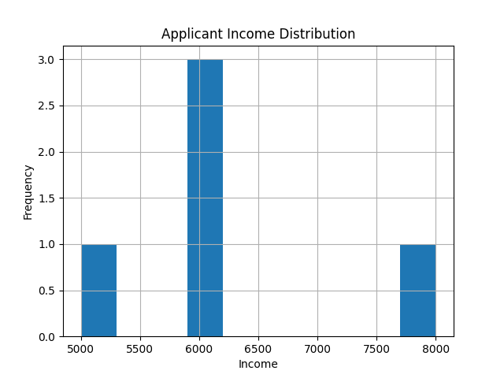
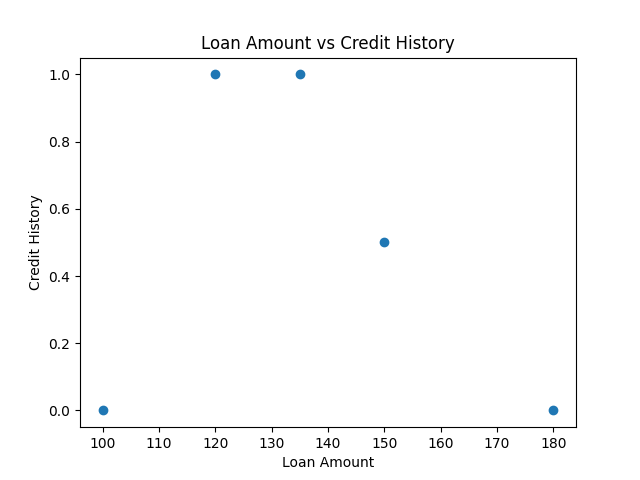

# Data Cleaning and Visualization Tool

## Description
A Python utility that automatically cleans CSV datasets and generates basic visualizations.

## Features
- Handles missing numerical values
- Saves cleaned dataset
- Generates distribution and scatter plots automatically

## Tools Used
- Python
- Pandas
- Matplotlib

## What I Learned
- Automating data preprocessing
- Writing reusable data tools
- Generating visual insights programmatically
## Sample Visualizations

